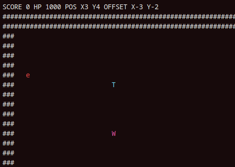
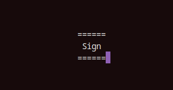

# Some game in console that I created out of boredom...

very WIP



`e` - player\
`T` - sign\
`W` - enemy\
`#` - walls



## controls
"w" + enter: up\
"s" + enter: down\
"a" + enter: left\
"d" + enter: right

--no idea how to listen to keys without key "enter".

## build and run
builds only on linux...
```shell
cmake CMakeLists.txt && make run
```